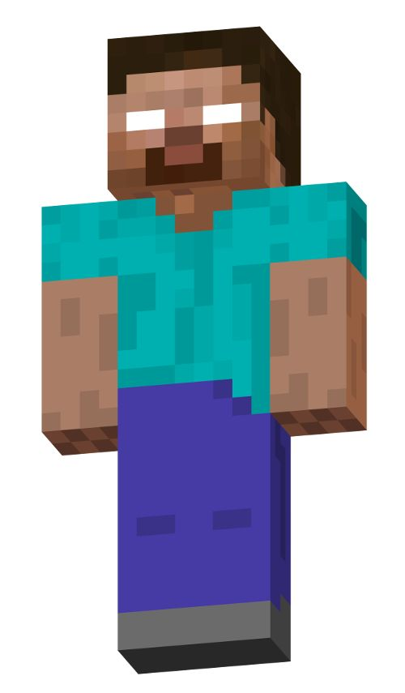

  <!-- Primeira coluna (Perfil) -->
  

    <h2 style="text-align: center;">Perfil</h2>
    
    
Meu nome é Nathan, nascido e criado no Brasil e atualmente gestor de engenharia ambiental na <a href="https://carbonspace.tech/">CarbonSpace</a>. 

    
Meus interesses oscilam entre sensoriamento remoto, programação, hidrologia e, recentemente, me aventurando por mecânica dos fluidos. 

  

  <!-- Segunda coluna (Português e Inglês juntos) -->
  

    <!-- Subdivisão Português -->
    

      <h2 style="text-align: center;">Português</h2>
      
Meu nome é Nathan, nascido e criado no Brasil e atualmente gestor de engenharia ambiental na <a href="https://carbonspace.tech/">CarbonSpace</a>. 

      
Meus interesses oscilam entre sensoriamento remoto, programação, hidrologia e, recentemente, me aventurando por mecânica dos fluidos. 

    

  

